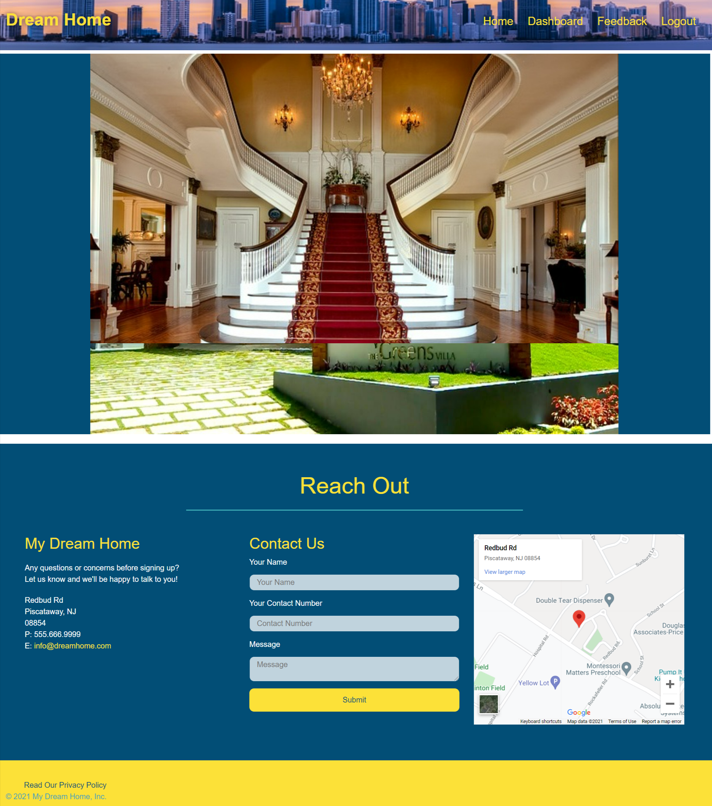
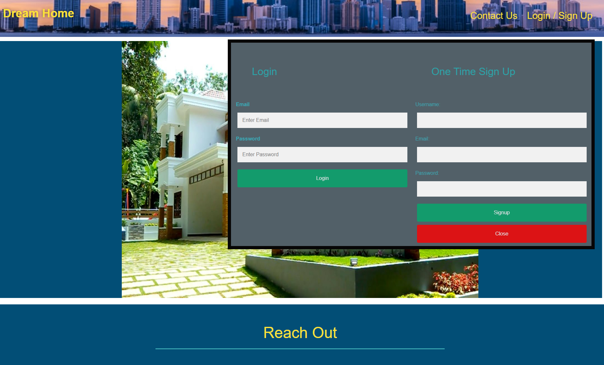
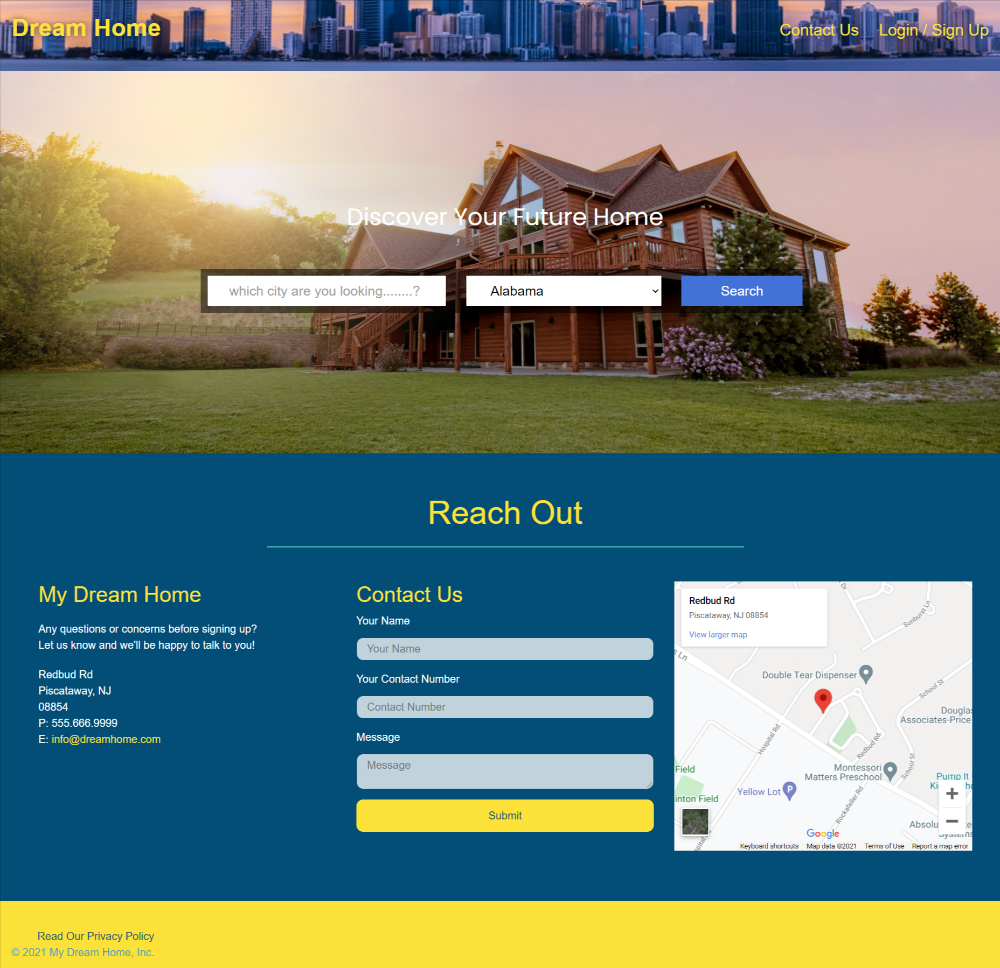
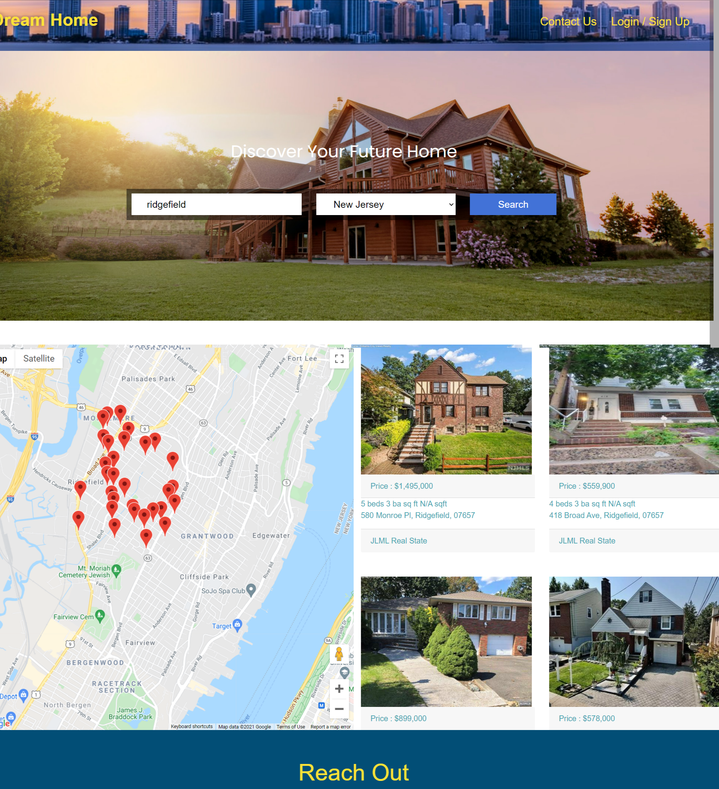
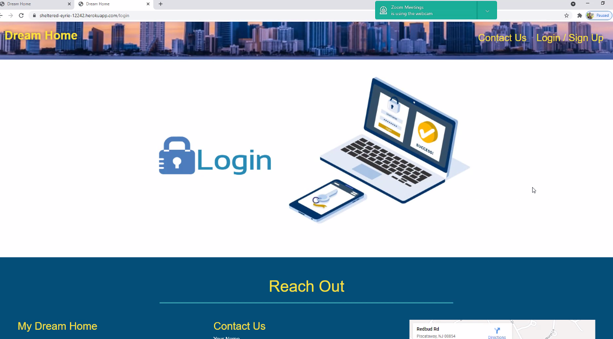

   
   

  
  

  
  # Dream-Home

  
  
   
   
  
  <a href="#about"><strong>Explore the screenshots »</strong></a>
   
   
  
  

  
  
  
  

   
  

  
   
   

  
  
    
  

  
   
     
   

  
  

  
Table of Contents

  
  - [About](#about)
  - [Built With](#built-with)
  - [Usage](#Usage)
  - [Authors & contributors](#Authors--contributors)
  - [Acknowledgements](#Acknowledgements)
  - [License](#License) 
  - [Disclaimer](#Disclaimer) 
  
  
  
  
   
     
   

  
  ## 
  About 

  ---
  

   

 Real estate apps are mobile applications aimed at making the process of property transactions easy. These apps are designed in a way that makes it easy for buyers, sellers, realtors, landlords, and investors to find each other quickly and conveniently.

 Real estate apps consist of vast databases with hundreds of thousands, and in some cases millions, of properties listed in them. This helps buyers look for their ideal home within the comfort of their homes, cars, or even from across the country. Sellers, landlords, and property managers also benefit from these apps as they can post details of their listings on multiple channels.

   
   

  

  

  
  

     
Screenshots and Demo

    
  
   
   
   
   
   
   
   
   
   
   
   
   
   
   
   
   
   
   
   
   
   

   
   
  

 

please to watch the A walkthrough video demonstrating the functionality of the application. <a href= "https://www.awesomescreenshot.com/video/5448464?key=226c1ccf2356ce4a29794751df356d50">click here</a>

  

  
   
   
   
   
  
  
  # Built With
  

   

> - <a href="https://www.w3schools.com/css/">CSS</a>
    

        
INFO

        <ul>
            <li> is a programming language used primarily by Web browsers to create a dynamic and interactive experience for the user
        </ul>
    
 
> - <a href="https://developer.mozilla.org/en-US/docs/Mozilla/Add-ons/WebExtensions/API">JavaScript</a>
    

        
INFO

            <ul>
                <li> language for describing the presentation of Web pages, including colors, layout, and fonts. It allows one to adapt the presentation to different types of devices, such as large screens, small screens, or printers. 
            </ul>
        
 
> - <a href="https://nodejs.org/en/">Node</a>
    

        
INFO

            <ul>
                <li> Node.js is an open-source and cross-platform JavaScript runtime environment. is primarily used for non-blocking, event-driven servers, due to its single-threaded nature. It's used for traditional web sites and back-end API services, but was designed with real-time, push-based architectures in mind.
            </ul>
        
 
> - <a href="https://www.tutorialspoint.com/nodejs/nodejs_express_framework.htm">express</a>
        

            
INFO

             <ul>
                <li> Express is to provide server-side logic for web and mobile applications, and as such it's used all over the place.
            </ul>
        

> - <a href="https://www.w3schools.com/js/js_es6.asp">ES6</a>
    

        
INFO

             <ul>
                <li> JavaScript ES6 brings new syntax and new awesome features to make your code more modern and more readable. It allows you to write less code and do more. ES6 introduces us to many great features like arrow functions, template strings, class destruction, Modules… and more
            </ul>
        
    
> - <a href="https://www.npmjs.com/package/mysql2">Node SQL 2</a>
    

        
INFO

             <ul>
                <li>  it is the standard language for relational database management systems. SQL statements are used to perform tasks such as update data on a database, or retrieve data from a database.
            </ul>
        

> - <a href="https://sequelize.org/v3/">Sequelize</a>
    

        
INFO

             <ul>
                <li> Sequelize is a powerful library in Javascript that makes it easy to manage a SQL database. Sequelize can layer over different protocols, but here we'll use PostgreSQL. At its core, Sequelize is an Object-Relational Mapper – meaning that it maps an object syntax onto our database schemas. Sequelize uses Node.
            </ul>
        

> - <a href="https://www.npmjs.com/package/nodemon">Nodemon</a>
    

        
INFO

             <ul>
                <li> nodemon is a tool that helps develop node. js based applications by automatically restarting the node application when file changes in the directory are detected. nodemon does not require any additional changes to your code or method of development.
            </ul>
        

> - <a href="https://www.npmjs.com/package/dotenv">dotenv</a>
    

        
INFO

             <ul>
                <li> dotenv allows you to separate secrets from your source code. This is useful in a collaborative environment (e.g., work, or open source) where you may not want to share your database login credentials with other people. Instead, you can share the source code while allowing other people to create their own 
            </ul>
        

> - <a href="https://www.npmjs.com/package//axios">axios</a>
    

        
INFO

             <ul>
                <li> Axios is a Javascript library used to make HTTP requests from node.js or XMLHttpRequests from the browser and it supports the Promise API that is native to JS ES6. It can be used intercept HTTP requests and responses and enables client-side protection against XSRF. It also has the ability to cancel requests. 
            </ul>
        

> - <a href="https://www.npmjs.com/package/express-session">Handlebars</a>
    

        
INFO

             <ul>
                <li> Handlebars is a simple templating language. It uses a template and an input object to generate HTML or other text formats. Handlebars templates look like regular text with embedded Handlebars expressions.
            </ul>
        

> - <a href="https://www.npmjs.com/package/bcrypt">bcrypt</a>
    

        
INFO

             <ul>
                <li> Yhe bcrypt hashing function allows us to build a password security platform that scales with computation power and always hashes every password with a salt.
            </ul>
        

> - <a href="https://www.npmjs.com/package/connect-session-sequelize">connect-session-sequelize</a>
    

        
INFO

             <ul>
                <li> A connect module based on a fork of sequelize-restful that adds a one level of associative capability to a restful API. It also lets you define which model should be exposed through this restful API.
            </ul>
    

> - <a href="https://www.npmjs.com/package/jest">Jest</a>
    

        
INFO

             <ul>
                <li> Jest is an open-source testing framework built on JavaScript, designed majorly to work with React and React Native based web applications. Often, unit tests are not very useful when run on the frontend of any software. This is mostly because unit tests for the front-end require extensive, time-consuming configuration.
            </ul>
    

   
   
  
  #  Usage 
  

   
    

   1. click on the Heroku icon to go directly into to the site.

   2. Login or SignUp to enjoy all the benefits of the site.
   3. click & navigate into the Dashboard.
   4. choose any of the three categories shown (if you want to look for a house , a lawyer , or a reliable bank for you loan).
   5. Inside search for a home , you can place the town or city and the state where you would like to start you next adventure.
   6. Back on Dashboard we have a list of Banks and Lawyers for you to choose from.
   7. If you enjoy this website ,please dont forget to leave a feedback to improve our services.
   8. Log Out.
   9. Enjoy  

  
   
   

  

  
  

   

 

    
Admin Use only.  

        <ul>
            <li> Please make sure you are logged in, to be able to make changes on the DataBase.
            <li> To add , update or delete info for Banks options use this link. [ https://sheltered-eyrie-12242.herokuapp.com/bank/add-bank ]
                <li> To add , update or delete info for Lawyer option use the fallowing link. [ https://sheltered-eyrie-12242.herokuapp.com/lawyer/add-lawyer]
        </ul>  
 

   
   
   
  
  
  #  Authors & contributors
  

   

   

  
Jose Luis Mejia Laguna.  

    <ul>
        <li> Google map API Post & Get request && Realty in us DB Post and Get Routes , js Models and Handlebars files related to search houses portion.
    </ul>  
  
  

   

   

  
Julian Wilson.  

    <ul>
        <li> JS Bank Get ,Post , Update , Delete Route Author , Js models & Handlebars files related to Banks info portion.
    </ul>  
  
  

   

   

  
 Miraj Patel. 

    <ul>
        <li> JS Lawyer Get ,Post , Update , Delete Route Author , Js models & Handlebars files related to the Lawyer info portion.
    </ul> 
  
  
  

    
 

  

  

  
Maria Soares.  

    <ul>
        <li> Wild Card (helped every one)
    </ul>  
  
  
 

   
 
  

  
Walter Gonzales.  

    <ul>
        <li> contact portion of the site routes && js Models
    </ul>  
  
  

   
   

  # Acknowledgements
  

   

First off , thanks for taking the time to check out my app! , contribution are what make this open-source community such an amazing place to learn , inspire and create. Any contribution you make will benefit everyone interested in using the app and are very appriciated.

   
   
  

  # 
  Disclaimer 

  
   

  
  All the Pictures used in this presentation and project are downloaded from online.​ We do not claim any ownership of any digital picture. ​
    The sole intention is to use it for learning purpose only.
     
 
    
    

  
  # License 
  
   

   

 

  
  
  

 

  

 

<a href="https://github.com/miraj00/Dream-Home/issues/7" >For any Question and to point out a bug please click here...</a> 

